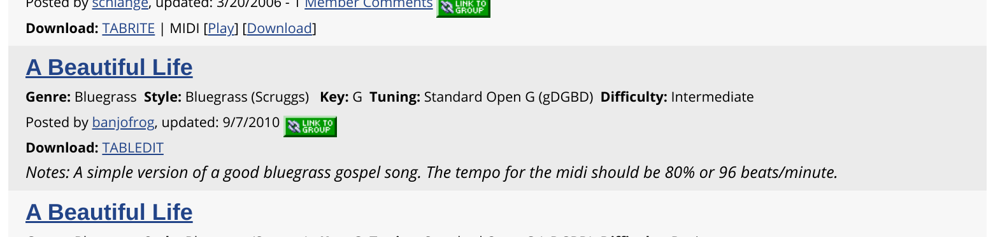

# banjo_hangout_download

Scraping tabs posted to the banjo hangouts archive.

This is a minimally functional version that has cached about 2,000 tabs from the
banjo hangout archive that were parsable from the various lists.

There are about 8,000 total tabs, six thousand are not included here due to:

*   Errors parsing the html cache
*   Tabs are not in TablEdit format (TEF)
*   There was an error downloading the tab, due to a server timeout or malformed
    file

I've parsed whatever data is available for each tab, which is broadly:

*   Genre (Bluegrass, Country, Old Time, Jazz, etc)
*   Style (Clawhammer, Scruggs, Old Time, etc)
*   Title (usually whatever the user input)
*   Tuning (should be also obvious from the tab)

The data is pretty messy still (but almost there!). I parsed everything using a
combination of `requests`, `Beautiful Soup` and regular expressions, but the
regular expressions need to be tuned a bit more. Each `div` has been identified
by getting a list of all `div`s containing tab links, and then regular
expressions are used to parse out the details. Here's an example of the data
container:



The issue is that there isn't an awesome tree structure to parse out here:

```html
<div class="row zebra rowPadded">
  <div class="column small-12">
    <h2 class="noSpacing bold">
      <a href="/tab/browse.asp?m=detail&amp;v=13806">A Beautiful Life</a>
    </h2>
    <p class="noSpacing">
      <span class="small">
        <strong>
	  Genre:
        </strong>
	Bluegrass&nbsp;&nbsp;
	<strong>
	  Style:
	</strong>
        Bluegrass (Scruggs) &nbsp;&nbsp;
	<strong>
	  Key:
	</strong>
	G&nbsp;&nbsp;
	<strong>
	  Tuning:
	</strong>
	Standard Open G (gDGBD)&nbsp;&nbsp	<strong>
	  Difficulty:
	</strong>
	Intermediate
	<br>
	Posted by <a href="/my/banjofrog">banjofrog</a>, updated: 9/7/2010 <a class="hide-print" href="javascript:;" onclick="linkImageWindow=dhtmlmodal.open('modal_window', 'iframe', '/groups/group-link.asp?contentTypeID=14&amp;contentID=13806&amp;contentID2=', '', 'width=480px,height=303px,center=1,resize=0,scrolling=0', 'recal');return false;" title="Link This Content to a Group"></a>
        <br>
	<strong>
	  Download:
	</strong>
	<a href="https://www.hangoutstorage.com/banjohangout.org/storage/tabs/a/tab-a-beautiful-lif-13806-122011792010.tef">TABLEDIT</a>
       </span>
       <br><i>Notes: A simple version of a good bluegrass gospel song.  The tempo for the midi should be 80% or 96 beats/minute.</i>
     </p>
   </div>
 </div>
```

I guess all the "good stuff" is in the inner paragraph tags (e.g. `<p></p>`, but
there isn't a super clean way to extact it. I used regular expressions on
plain-text to pull the 'Key-Value' stuff, but it's not perfect.

The approach I took, given that this is messy, is to apply subsequent operations
and cache intermediate steps. This allows me to tune eveything on static pages
that are downloaded.

The way the code is currently executed:

1. [`download_tab_lists.py`](./download_tab_lists.py) downloads each html page
   that has lists of tabs.  Fortunately, these pages are regularly formatted, so
   the URLs are cached and read by the script in
   [`url_list.json`](./url_list.json). The pages are downloaded and cahched in
   the directory [`http_cache`](./http_cache).
2. [`parse_tablists.py`](./parse_tablists.py) reads each cached page, and parses
   out the relevant information, storing the containers as plaintext and html
   text. This parsed information is stored as a big json list
   [`parsed.json`](./parsed.json).
3. [`download_tabs.py`](./download_tabs.py) reads each element from
   `parsed.json` and downloads the tab URL, if it exists, caching tabs to
   [`raw_tabs`](./raw_tabs). Identifying information about each uniquely named
   tab is stored in [`raw_tab_list.json`](./raw_tab_list.json).

## Next steps

While it seems there is a good amount of tef files that have been scraped, I
think there could be more to do. I would like to check the coverage of the
downloads as well as see if I can't clean up the parsing portions a bit better.
Spot checking the cached `json` data indicates there are a few missed
edge-cases.

Even still, there seems to be a good wealth of tabs here!

